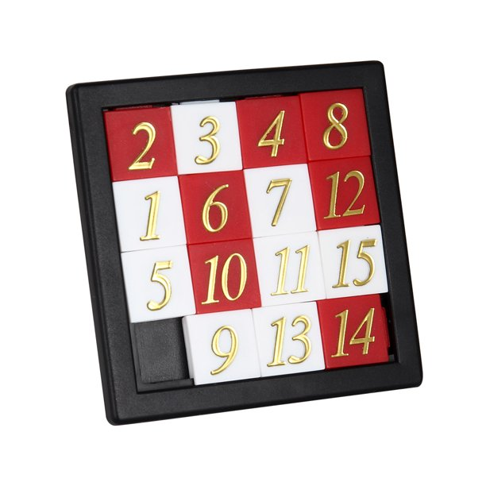

# number-puzzle

Number Puzzle is a classic game sold at truckstops, and make for a great distraction on road trips.

## How to play.

The puzzle is a square 4 by 4 with 15 tiles each with a number placed randomly. The
goal is to make the tiles sequential in the fewest moves possible. This can be done by
swapping any tile adjacent to the 1 empty space on the 4 by 4 square.

Good Luck!
